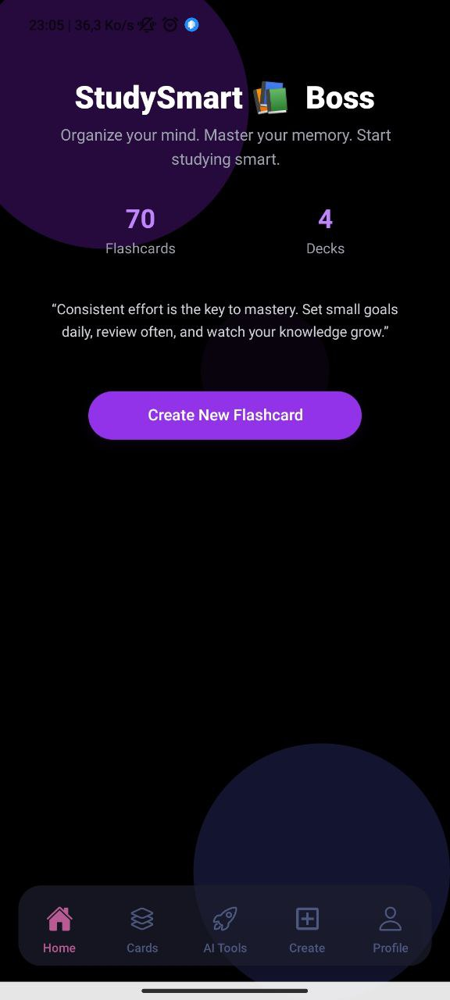
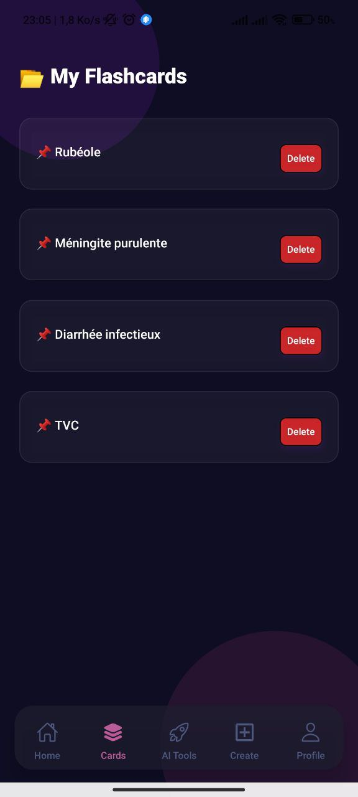
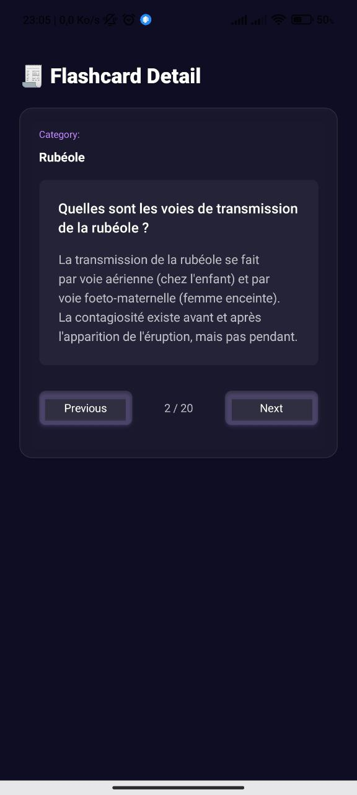
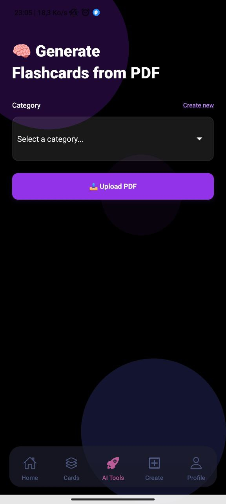
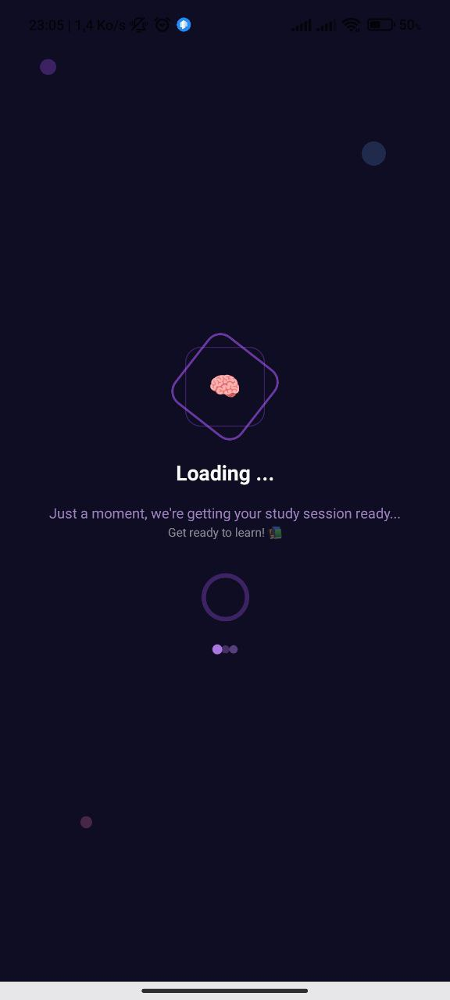

# 📚 Flashcards App

<div align="center">
  
  <br/>
  <em>A full-stack flashcards application with a React Native frontend and Laravel backend.</em>
</div>

## 🚀 Features

### ✨ Frontend (React Native)
- 🔐 User authentication with secure login/register
- 📂 Category management and organization
- ✏️ Flashcard creation and editing
- 📖 Study mode with intuitive swipe gestures
- 🤖 **AI-powered flashcard generation from PDF documents**
- 🎨 Modern UI with Tailwind CSS
- 🔧 TypeScript for enhanced development experience

### ⚙️ Backend (Laravel)
- 🌐 RESTful API with comprehensive endpoints
- 🔒 User authentication with Laravel Sanctum
- 🗄️ Database migrations and seeders
- 🌍 CORS configuration for cross-origin requests
- ✅ Input validation and error handling
- 📊 API resources for consistent JSON responses
- 🤖 **AI service integrations (Gemini)**
- 📄 **PDF parsing and AI-powered content analysis**
- 💬 **Real-time streaming chatbot responses**

## 📱 Screenshots

<div align="center" style="display: flex; justify-content: center; align-items: center; gap: 20px; flex-wrap: wrap;">
  <div style="text-align: center;">
    
    <br/>
    <em>Main Screen</em>
  </div>
  
  <div style="text-align: center;">
    
    <br/>
    <em>Cards View</em>
  </div>
  
  <div style="text-align: center;">
    
    <br/>
    <em>Card Details</em>
  </div>
  
  <div style="text-align: center;">
    
    <br/>
    <em>Generate Cards</em>
  </div>
  
  <div style="text-align: center;">
    
    <br/>
    <em>Loading Screen</em>
  </div>
</div>

## 🤖 AI Features

### 🧠 **AI-Powered Flashcard Generation**
- **PDF Document Analysis**: Upload any PDF document and automatically generate flashcards
- **Smart Content Extraction**: AI analyzes the document content and creates relevant questions and answers
- **AI Provider**: Gemini
- **Structured Output**: Automatically formats flashcards with proper Q&A structure
- **Category Organization**: Generated flashcards are automatically organized into categories

## 🏗️ Project Structure

```
├── my-app/                 # React Native Frontend (Expo)
│   ├── app/               # App screens and navigation
│   ├── components/        # Reusable components
│   ├── services/          # API services
│   ├── context/           # React Context providers
│   ├── constants/         # App constants
│   ├── utils/             # Utility functions
│   └── assets/            # Images, fonts, etc.
└── Flashcards_back/        # Laravel Backend
    ├── app/               # Laravel application logic
    ├── routes/            # API routes
    ├── database/          # Migrations and seeders
    ├── config/            # Configuration files
    └── resources/         # Views and assets
```

## 📋 Prerequisites

- **Node.js** (v16 or higher)
- **PHP** (v8.1 or higher)
- **Composer**
- **Expo CLI**
- **Git**

## 🛠️ Installation & Setup

### Frontend Setup (React Native)

#### 1. Navigate to the frontend directory
```bash
cd my-app
```

#### 2. Install dependencies
```bash
npm install
```

#### 3. Start the development server
```bash
npx expo start
```

#### 4. Run on device/simulator
- Press `a` for Android
- Press `i` for iOS
- Scan QR code with Expo Go app

### Backend Setup (Laravel)

#### 1. Navigate to the backend directory
```bash
cd Flashcards_back
```

#### 2. Install PHP dependencies
```bash
composer install
```

#### 3. Copy environment file
```bash
cp .env.example .env
```

#### 4. Generate application key
```bash
php artisan key:generate
```

#### 5. Configure database
Edit `.env` file with your database credentials:
```env
DB_CONNECTION=mysql
DB_HOST=127.0.0.1
DB_PORT=3306
DB_DATABASE=flashcards_db
DB_USERNAME=your_username
DB_PASSWORD=your_password
```

#### 6. Run migrations
```bash
php artisan migrate
```

#### 7. Seed the database (optional)
```bash
php artisan db:seed
```

#### 8. Start the development server
```bash
php artisan serve
```

The API will be available at `http://localhost:8000`

## 🔌 API Endpoints

The Laravel backend provides the following API endpoints:

### Authentication
- `POST /api/auth/login` - User login
- `POST /api/auth/register` - User registration

### Categories
- `GET /api/categories` - Get all categories
- `POST /api/categories` - Create a new category

### Flashcards
- `GET /api/flashcards` - Get all flashcards
- `POST /api/flashcards` - Create a new flashcard
- `PUT /api/flashcards/{id}` - Update a flashcard
- `DELETE /api/flashcards/{id}` - Delete a flashcard

### AI Services
- `POST /api/ai/generate-flashcards` - Generate flashcards from PDF using AI

## 🛠️ Development

### Frontend Development
- The app uses **Expo** for easy development and testing
- **TypeScript** is configured for better development experience
- **Tailwind CSS** is used for styling
- **React Context** is used for state management

### Backend Development
- **Laravel 10+** with modern PHP practices
- **API resources** for consistent JSON responses
- **Database migrations** for version control
- **Sanctum** for API authentication

## 🤝 Contributing

1. Fork the repository
2. Create a feature branch (`git checkout -b feature/amazing-feature`)
3. Commit your changes (`git commit -m 'Add some amazing feature'`)
4. Push to the branch (`git push origin feature/amazing-feature`)
5. Open a Pull Request

## 📄 License

This project is open source and available under the [MIT License](LICENSE).

---

<div align="center">
  <p>Made with ❤️ by <a href="https://github.com/yahiaAnes">Yahia Anes</a></p>
  <p>⭐ Star this repository if you found it helpful!</p>
</div> 